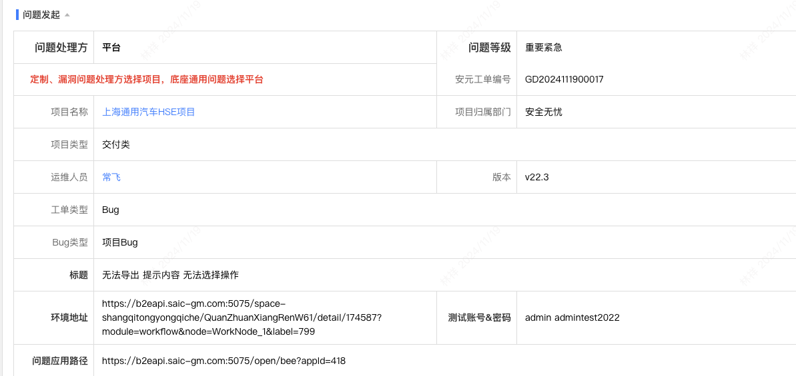
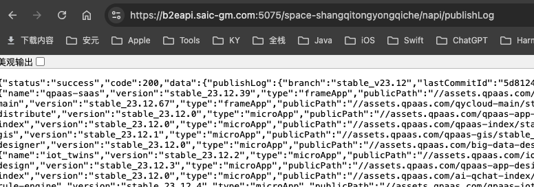
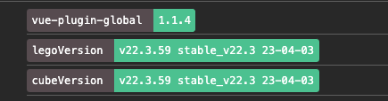
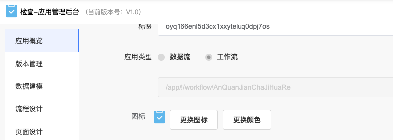
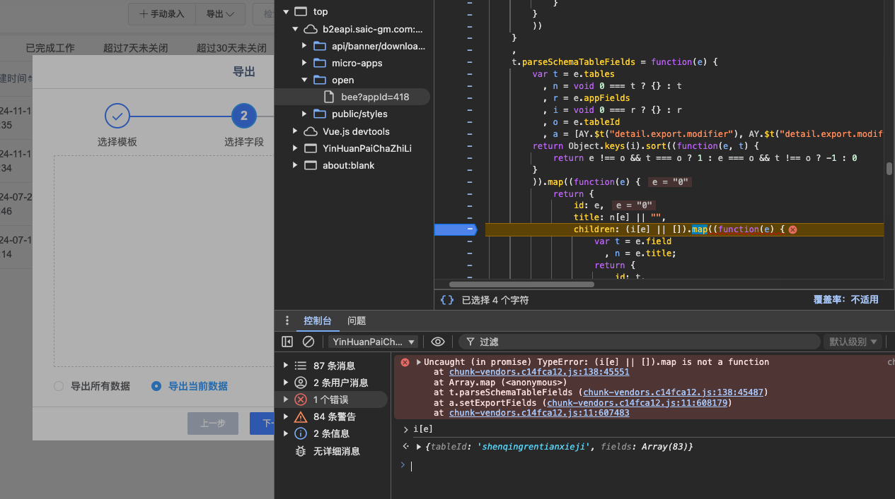

# 工单 - GD2024111900017 （2024.11.19）

## 环境

* https://b2eapi.saic-gm.com:5075/space-shangqitongyongqiche/QuanZhuanXiangRenW61/detail/174587?module=workflow&node=WorkNode_1&label=799
    * admin / admintest2022
* 错误应用：https://b2eapi.saic-gm.com:5075/open/bee?appId=418

## 查找过程

### 1. 先平台查看版本

* https://b2eapi.saic-gm.com:5075/space-shangqitongyongqiche/napi/publishLog

### 2. 查看lego、cube版本

### 3. 先统一版本

### 4. 打开应用，与 原生应用对比

* 问题应用地址：https://b2eapi.saic-gm.com:5075/open/bee?appId=418
    * 内部应用地址：域名 +  /bee/sqty/lego/workflow/YinHuanPaiChaZhiLi
    * https://b2eapi.saic-gm.com:5075/bee/sqty/lego/workflow/YinHuanPaiChaZhiLi

* 原生应用地址：https://b2eapi.saic-gm.com:5075/space-shangqitongyongqiche/app/!/workflow/YinHuanPaiChaZhiLi

### 5. 问题截图

### 6. 移交给项目『荀志斌』查看

## 最终解决。帮助他们直接升级CDN

代码仓库：lego-cli-web

