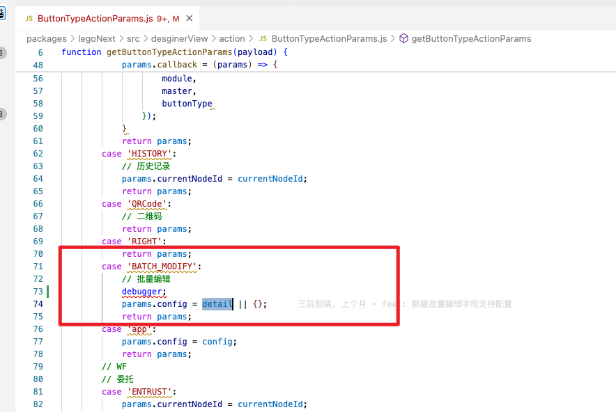

# 运行本地Lego调试 - 参考专业文档

《Lego源码运行+工程引入本地运行的Lego，打断点》


# 工单 - GD2025050900047


## 项目介绍

* 描述：定制页系统按钮批量修改，在后台按钮设置，配置可修改字段范围选择自定义范围勾选部分字段，原生页批量修改添加字段展示勾选的字段，lego定制的页面展示全部的字段

* 环境地址：http://whhxaqscgl-wuyou229fuwushang-jyahhj.k8s-assembly-machine.qpaas.com/

* 测试账号&密码：admin_whhx aykj8888


## 问题描述


## 问题排查

经过对比 `DesignerAppView` 是否拦截 `            :on-view-action-call-back="onViewActionCallBack"` ：


### a. 这是正常的


### b. 这是有问题的 - 拦截了点击事件


## 排查过程

### a. qpaas-app-view源码中

```sh
定制执行方法：packages/legoNext/src/service/components/view/Action/src/Actions/MultiEdit.vue
平台执行方法：packages/legoNext/src/desginerView/action/onViewAction.js
```


## 解决方案

对比正常 与 有问题的数据流程，发现正常时，数据中有一个步骤：`params.config = detail`




所以在有问题的地方，补全 `config` 参数：


