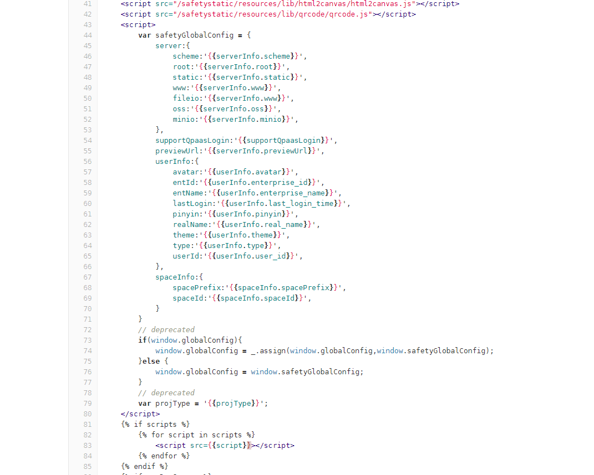
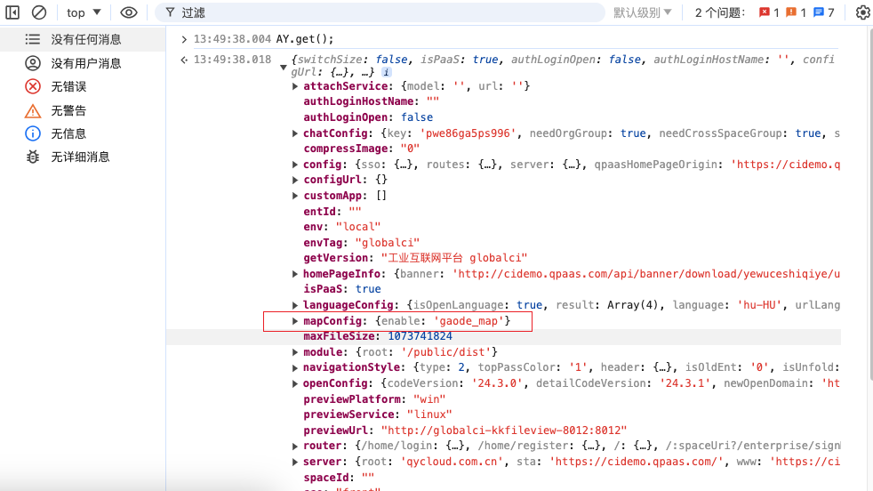
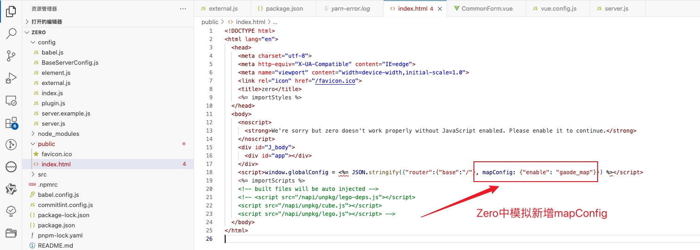
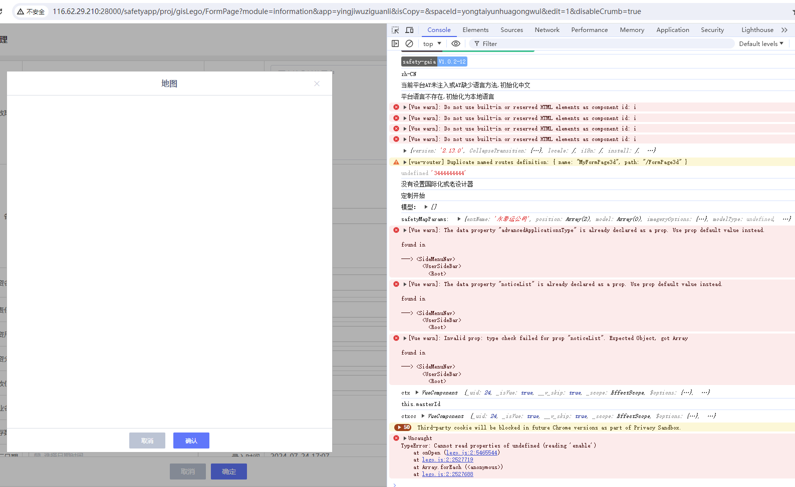
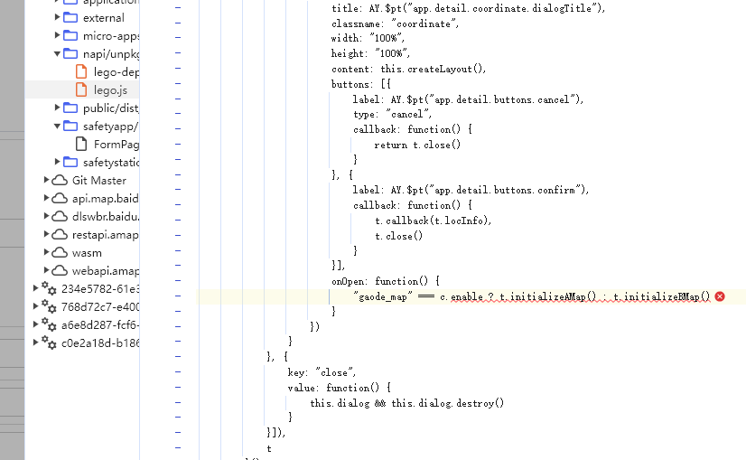
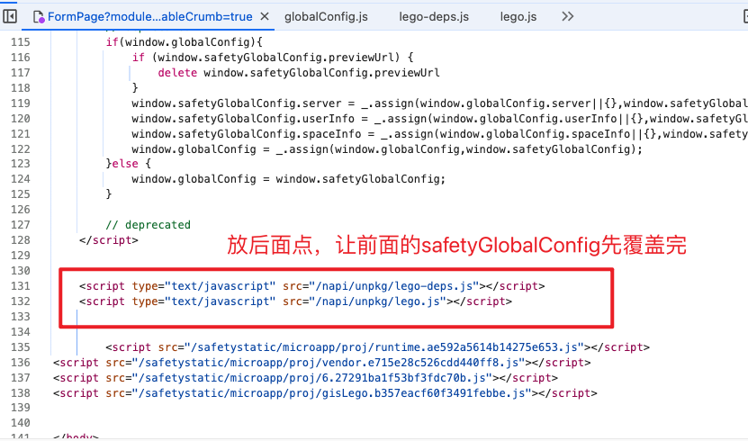

对接人：诈丹丹，可看聊天记录


1. cdn引入 lego和cube版本，说明版本没有问题；


2. 地图仍然不显示，发现没有mapConfig

因为无忧 替换为 safetyGlobalConfig，在里面新增mapConfig

```
mapConfig: {
    "enable": "gaode_map"
}
```







在无忧自定义的safetyGlobalConfig中新增mapConfig ，可以正常打开地图弹框；

在Zero项目中如何新增mapConfig呢？




但是发现地图仍然不显示；

后发现，script加载顺序的问题，取值的时候，safetyGlobalConfig还没有覆盖。





